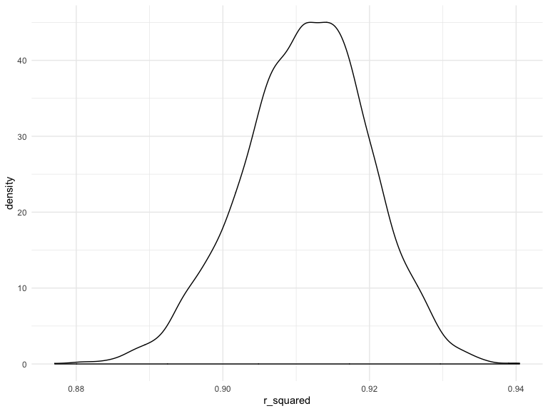

p8105\_hw6\_lk2761
================
Lorraine Kwok
November 19, 2019

## Problem 1

This problem utilizes data on children’s birthweight and variables that
may be related to this variable.

This code chunk loads and tidies the data.

``` r
birthweight = 
  read_csv("./data/birthweight.csv") %>%
  janitor::clean_names() %>%
  mutate(
    babysex = as.factor(babysex),
    frace = as.factor(frace),
    mrace = as.factor(mrace),
    malform = as.factor(malform),
    babysex = recode(babysex, `1` = "male", `2` = "female"),
    frace = recode(frace, `1` = "white", `2` = "black", `3` = "asian", `4` = "puerto rican", `8` = "other", `9` = "unknown"),
    mrace = recode(mrace, `1` = "white", `2` = "black", `3` = "asian", `4` = "puerto rican", `8` = "other"),
    malform = recode(malform, `0` = "absent", `1` = "present")) %>%
  view()
```

This code chunk fits a regression model. The predictors included are
`momage`, `smoken`, `ppbmi`, `ppwt` and
`delwt`.

``` r
fit = lm(bwt ~ momage + smoken + ppbmi + ppwt + delwt, data = birthweight)
```

This code creates a scatterplot comparing the residuals against the
fitted values.

``` r
birthweight %>%
  modelr::add_residuals(fit) %>%
  modelr::add_predictions(fit) %>%
  ggplot(aes(x = pred, y = resid)) + 
  geom_point()
```


The following code chunk generates two other models.

``` r
fit_main = lm(bwt ~ blength + gaweeks, data = birthweight)

fit_interaction = lm(bwt ~ bhead + blength + babysex + bhead * blength + bhead * babysex + blength * babysex + bhead * blength * babysex, data = birthweight)
```

We will use `crossv_mc` to compare the three models to each other.

``` r
cv_df = 
  crossv_mc(birthweight, 100) 

cv_df %>% pull(train) %>% .[[1]] %>% as_tibble
```

    ## # A tibble: 3,473 x 20
    ##    babysex bhead blength   bwt delwt fincome frace gaweeks malform menarche
    ##    <fct>   <dbl>   <dbl> <dbl> <dbl>   <dbl> <fct>   <dbl> <fct>      <dbl>
    ##  1 female     34      51  3629   177      35 white    39.9 absent        13
    ##  2 male       34      48  3062   156      65 black    25.9 absent        14
    ##  3 female     36      50  3345   148      85 white    39.9 absent        12
    ##  4 male       34      52  3062   157      55 white    40   absent        14
    ##  5 female     34      52  3374   156       5 white    41.6 absent        13
    ##  6 female     33      46  2523   126      96 black    40.3 absent        14
    ##  7 male       36      52  3515   146      85 white    40.3 absent        11
    ##  8 male       33      50  3459   169      75 black    40.7 absent        12
    ##  9 female     35      51  3317   130      55 white    43.4 absent        13
    ## 10 male       35      51  3459   146      55 white    39.4 absent        12
    ## # … with 3,463 more rows, and 10 more variables: mheight <dbl>,
    ## #   momage <dbl>, mrace <fct>, parity <dbl>, pnumlbw <dbl>, pnumsga <dbl>,
    ## #   ppbmi <dbl>, ppwt <dbl>, smoken <dbl>, wtgain <dbl>

``` r
cv_df %>% pull(test) %>% .[[1]] %>% as_tibble
```

    ## # A tibble: 869 x 20
    ##    babysex bhead blength   bwt delwt fincome frace gaweeks malform menarche
    ##    <fct>   <dbl>   <dbl> <dbl> <dbl>   <dbl> <fct>   <dbl> <fct>      <dbl>
    ##  1 male       33      52  3374   129      55 white    40.7 absent        12
    ##  2 female     33      49  2778   140       5 white    37.4 absent        12
    ##  3 female     35      48  3175   158      75 white    39.7 absent        13
    ##  4 female     35      53  3345   127      65 black    39.7 absent        14
    ##  5 male       34      63  3175   143      25 white    41.9 absent        13
    ##  6 female     35      52  3289   135      55 white    40.6 absent        13
    ##  7 male       35      52  3232   121      75 asian    42.3 absent        13
    ##  8 female     34      49  2948   135      75 white    42.7 absent        12
    ##  9 male       34      52  3118   130      75 white    41   absent        12
    ## 10 male       33      50  3175   168      25 white    40   absent        13
    ## # … with 859 more rows, and 10 more variables: mheight <dbl>,
    ## #   momage <dbl>, mrace <fct>, parity <dbl>, pnumlbw <dbl>, pnumsga <dbl>,
    ## #   ppbmi <dbl>, ppwt <dbl>, smoken <dbl>, wtgain <dbl>

``` r
cv_df =
  cv_df %>% 
  mutate(
    train = map(train, as_tibble),
    test = map(test, as_tibble))
```

``` r
cv_df = 
  cv_df %>% 
  mutate(my_mod  = map(train, ~lm(bwt ~ momage + smoken + ppbmi + ppwt + delwt, data = .x)),
         main_mod  = map(train, ~mgcv::gam(bwt ~ blength + gaweeks, data = .x)),
         interaction_mod  = map(train, ~gam(bwt ~ bhead + blength + babysex + bhead * blength + bhead * babysex + blength * babysex + bhead * blength * babysex, data = .x))) %>% 
  mutate(rmse_my = map2_dbl(my_mod, test, ~rmse(model = .x, data = .y)),
         rmse_main = map2_dbl(main_mod, test, ~rmse(model = .x, data = .y)),
         rmse_interaction = map2_dbl(interaction_mod, test, ~rmse(model = .x, data = .y))) %>% view()
```

This code generates a violin plot that compares the three models using
the root mean squared error (RMSE).

``` r
cv_df %>% 
  select(starts_with("rmse")) %>% 
  pivot_longer(
    everything(),
    names_to = "model", 
    values_to = "rmse",
    names_prefix = "rmse_") %>% 
  mutate(model = fct_inorder(model)) %>% 
  ggplot(aes(x = model, y = rmse, fill = model)) + 
  geom_violin()
```


Based on the plot that is generated, I would select the model with the
interaction terms as it has the lowest RMSE of the three models.

## Problem 2

This loads and tidies the weather data for Central Park, NY.

``` r
weather_df = 
  rnoaa::meteo_pull_monitors(
    c("USW00094728"),
    var = c("PRCP", "TMIN", "TMAX"), 
    date_min = "2017-01-01",
    date_max = "2017-12-31") %>%
  mutate(
    name = recode(id, USW00094728 = "CentralPark_NY"),
    tmin = tmin / 10,
    tmax = tmax / 10) %>%
  select(name, id, everything())
```

This draws one bootstrap sample.

``` r
boot_sample = function(df) {
  sample_frac(df, replace = TRUE)
}
```

``` r
boot_sample(weather_df) %>% 
  ggplot(aes(x = tmin, y = tmax)) + 
  geom_point(alpha = .5) +
  stat_smooth(method = "lm")
```



Now we will draw 5000 bootstrap samples.

``` r
boot_straps = 
  data_frame(
    strap_number = 1:5000,
    strap_sample = rerun(5000, boot_sample(weather_df))
  )
```

Checking if bootstrapping is working

``` r
boot_straps %>% 
  filter(strap_number %in% 1:2) %>% 
  mutate(strap_sample = map(strap_sample, ~arrange(.x, tmin))) %>% 
  pull(strap_sample)
```

    ## [[1]]
    ## # A tibble: 365 x 6
    ##    name           id          date        prcp  tmax  tmin
    ##    <chr>          <chr>       <date>     <dbl> <dbl> <dbl>
    ##  1 CentralPark_NY USW00094728 2017-12-31     0  -6   -12.7
    ##  2 CentralPark_NY USW00094728 2017-12-29     0  -5.5 -11.6
    ##  3 CentralPark_NY USW00094728 2017-12-29     0  -5.5 -11.6
    ##  4 CentralPark_NY USW00094728 2017-12-29     0  -5.5 -11.6
    ##  5 CentralPark_NY USW00094728 2017-01-09     0  -4.9  -9.9
    ##  6 CentralPark_NY USW00094728 2017-03-05     0   2.8  -9.9
    ##  7 CentralPark_NY USW00094728 2017-01-08     0  -3.8  -8.8
    ##  8 CentralPark_NY USW00094728 2017-03-04     0  -1    -8.2
    ##  9 CentralPark_NY USW00094728 2017-03-04     0  -1    -8.2
    ## 10 CentralPark_NY USW00094728 2017-12-30    13  -4.9  -8.2
    ## # … with 355 more rows
    ## 
    ## [[2]]
    ## # A tibble: 365 x 6
    ##    name           id          date        prcp  tmax  tmin
    ##    <chr>          <chr>       <date>     <dbl> <dbl> <dbl>
    ##  1 CentralPark_NY USW00094728 2017-12-28     0  -7.7 -11.6
    ##  2 CentralPark_NY USW00094728 2017-03-05     0   2.8  -9.9
    ##  3 CentralPark_NY USW00094728 2017-03-05     0   2.8  -9.9
    ##  4 CentralPark_NY USW00094728 2017-01-08     0  -3.8  -8.8
    ##  5 CentralPark_NY USW00094728 2017-12-30    13  -4.9  -8.2
    ##  6 CentralPark_NY USW00094728 2017-03-11     0  -1.6  -8.2
    ##  7 CentralPark_NY USW00094728 2017-03-04     0  -1    -8.2
    ##  8 CentralPark_NY USW00094728 2017-03-04     0  -1    -8.2
    ##  9 CentralPark_NY USW00094728 2017-02-10     0   0    -7.1
    ## 10 CentralPark_NY USW00094728 2017-12-15    28  -2.1  -6.6
    ## # … with 355 more rows

``` r
fit_2 = lm(tmax ~ tmin, data = weather_df)
```

``` r
fit_2 %>%
  broom::glance()
```

    ## # A tibble: 1 x 11
    ##   r.squared adj.r.squared sigma statistic   p.value    df logLik   AIC
    ##       <dbl>         <dbl> <dbl>     <dbl>     <dbl> <int>  <dbl> <dbl>
    ## 1     0.912         0.911  2.94     3741. 2.98e-193     2  -910. 1827.
    ## # … with 3 more variables: BIC <dbl>, deviance <dbl>, df.residual <int>

``` r
weather_df %>% 
  modelr::bootstrap(n = 5000) %>% 
  mutate(
    models = map(strap, ~lm(tmax ~ tmin, data = .x) ),
    results = map(models, broom::glance)) %>% 
  select(-strap, -models) %>% 
  unnest(results) 
```

    ## # A tibble: 5,000 x 12
    ##    .id   r.squared adj.r.squared sigma statistic   p.value    df logLik
    ##    <chr>     <dbl>         <dbl> <dbl>     <dbl>     <dbl> <int>  <dbl>
    ##  1 0001      0.907         0.906  3.05     3522. 6.24e-189     2  -924.
    ##  2 0002      0.912         0.912  2.95     3771. 7.71e-194     2  -912.
    ##  3 0003      0.915         0.915  2.94     3906. 2.34e-196     2  -911.
    ##  4 0004      0.906         0.905  2.94     3479. 4.62e-188     2  -911.
    ##  5 0005      0.906         0.905  3.09     3482. 4.05e-188     2  -928.
    ##  6 0006      0.912         0.912  2.96     3777. 6.01e-194     2  -912.
    ##  7 0007      0.919         0.919  2.82     4118. 3.43e-200     2  -896.
    ##  8 0008      0.907         0.907  2.91     3542. 2.39e-189     2  -907.
    ##  9 0009      0.913         0.913  2.91     3822. 8.29e-195     2  -906.
    ## 10 0010      0.895         0.895  3.14     3097. 8.48e-180     2  -934.
    ## # … with 4,990 more rows, and 4 more variables: AIC <dbl>, BIC <dbl>,
    ## #   deviance <dbl>, df.residual <int>
