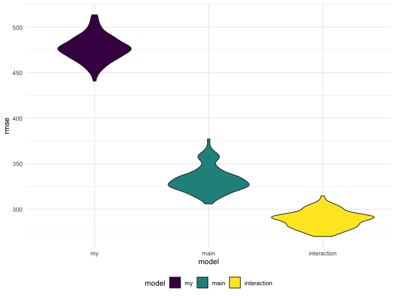

p8105\_hw6\_lk2761
================
Lorraine Kwok
November 19, 2019

## Problem 1

This problem utilizes data on children’s birthweight and variables that
may be related to this variable.

This code chunk loads and tidies the data.

``` r
birthweight = 
  read_csv("./data/birthweight.csv") %>%
  janitor::clean_names() %>%
  mutate(
    babysex = as.factor(babysex),
    frace = as.factor(frace),
    mrace = as.factor(mrace),
    malform = as.factor(malform),
    babysex = recode(babysex, `1` = "male", `2` = "female"),
    frace = recode(frace, `1` = "white", `2` = "black", `3` = "asian", `4` = "puerto rican", `8` = "other", `9` = "unknown"),
    mrace = recode(mrace, `1` = "white", `2` = "black", `3` = "asian", `4` = "puerto rican", `8` = "other"),
    malform = recode(malform, `0` = "absent", `1` = "present")) %>%
  view()
```

This code chunk fits a regression model based on a hypothesized
structure for factors that underly birthweight. The predictors included
are mom’s age (`momage`), average number of cigarettes smoked per day
during the pregnancy (`smoken`), mother’s pre-pregnancy BMI (`ppbmi`),
mother’s pre-pregnancy weight in pounds (`ppwt`) and mother’s delivery
weight in pounds
(`delwt`).

``` r
fit = lm(bwt ~ momage + smoken + ppbmi + ppwt + delwt, data = birthweight)
```

This code creates a scatterplot comparing the residuals against the
fitted values for my fitted model.

``` r
birthweight %>%
  modelr::add_residuals(fit) %>%
  modelr::add_predictions(fit) %>%
  ggplot(aes(x = pred, y = resid)) + 
  geom_point()
```


The following code chunk generates two other models: the first one using
the length at birth and gestational age in weeks as predictors and the
second one using head circumference, length, sex, and all interactions
(including the three-way interaction) between these as predictors.

``` r
fit_main = lm(bwt ~ blength + gaweeks, data = birthweight)

fit_interaction = lm(bwt ~ bhead + blength + babysex + bhead * blength + bhead * babysex + blength * babysex + bhead * blength * babysex, data = birthweight)
```

We will use `crossv_mc` and functions in `purrr` to compare the three
models to each other.

This code chunk creates the training and test datasets for the
cross-validation.

``` r
cv_df = 
  crossv_mc(birthweight, 100) 

cv_df %>% pull(train) %>% .[[1]] %>% as_tibble
```

    ## # A tibble: 3,473 x 20
    ##    babysex bhead blength   bwt delwt fincome frace gaweeks malform menarche
    ##    <fct>   <dbl>   <dbl> <dbl> <dbl>   <dbl> <fct>   <dbl> <fct>      <dbl>
    ##  1 female     34      51  3629   177      35 white    39.9 absent        13
    ##  2 male       34      48  3062   156      65 black    25.9 absent        14
    ##  3 female     36      50  3345   148      85 white    39.9 absent        12
    ##  4 male       34      52  3062   157      55 white    40   absent        14
    ##  5 female     34      52  3374   156       5 white    41.6 absent        13
    ##  6 female     33      46  2523   126      96 black    40.3 absent        14
    ##  7 male       36      52  3515   146      85 white    40.3 absent        11
    ##  8 male       33      50  3459   169      75 black    40.7 absent        12
    ##  9 female     35      51  3317   130      55 white    43.4 absent        13
    ## 10 male       35      51  3459   146      55 white    39.4 absent        12
    ## # … with 3,463 more rows, and 10 more variables: mheight <dbl>,
    ## #   momage <dbl>, mrace <fct>, parity <dbl>, pnumlbw <dbl>, pnumsga <dbl>,
    ## #   ppbmi <dbl>, ppwt <dbl>, smoken <dbl>, wtgain <dbl>

``` r
cv_df %>% pull(test) %>% .[[1]] %>% as_tibble
```

    ## # A tibble: 869 x 20
    ##    babysex bhead blength   bwt delwt fincome frace gaweeks malform menarche
    ##    <fct>   <dbl>   <dbl> <dbl> <dbl>   <dbl> <fct>   <dbl> <fct>      <dbl>
    ##  1 male       33      52  3374   129      55 white    40.7 absent        12
    ##  2 female     33      49  2778   140       5 white    37.4 absent        12
    ##  3 female     35      48  3175   158      75 white    39.7 absent        13
    ##  4 female     35      53  3345   127      65 black    39.7 absent        14
    ##  5 male       34      63  3175   143      25 white    41.9 absent        13
    ##  6 female     35      52  3289   135      55 white    40.6 absent        13
    ##  7 male       35      52  3232   121      75 asian    42.3 absent        13
    ##  8 female     34      49  2948   135      75 white    42.7 absent        12
    ##  9 male       34      52  3118   130      75 white    41   absent        12
    ## 10 male       33      50  3175   168      25 white    40   absent        13
    ## # … with 859 more rows, and 10 more variables: mheight <dbl>,
    ## #   momage <dbl>, mrace <fct>, parity <dbl>, pnumlbw <dbl>, pnumsga <dbl>,
    ## #   ppbmi <dbl>, ppwt <dbl>, smoken <dbl>, wtgain <dbl>

``` r
cv_df =
  cv_df %>% 
  mutate(
    train = map(train, as_tibble),
    test = map(test, as_tibble))
```

This code chunk fits models and obtains the root mean squared error
(RMSE) values for each of the three models.

``` r
cv_df = 
  cv_df %>% 
  mutate(my_mod  = map(train, ~lm(bwt ~ momage + smoken + ppbmi + ppwt + delwt, data = .x)),
         main_mod  = map(train, ~mgcv::gam(bwt ~ blength + gaweeks, data = .x)),
         interaction_mod  = map(train, ~gam(bwt ~ bhead + blength + babysex + bhead * blength + bhead * babysex + blength * babysex + bhead * blength * babysex, data = .x))) %>% 
  mutate(rmse_my = map2_dbl(my_mod, test, ~rmse(model = .x, data = .y)),
         rmse_main = map2_dbl(main_mod, test, ~rmse(model = .x, data = .y)),
         rmse_interaction = map2_dbl(interaction_mod, test, ~rmse(model = .x, data = .y))) %>% 
  view()
```

This code generates a violin plot that compares the three models using
the RMSE values for each candidate model.

``` r
cv_df %>% 
  select(starts_with("rmse")) %>% 
  pivot_longer(
    everything(),
    names_to = "model", 
    values_to = "rmse",
    names_prefix = "rmse_") %>% 
  mutate(model = fct_inorder(model)) %>% 
  ggplot(aes(x = model, y = rmse, fill = model)) + 
  geom_violin()
```



Based on the plot that is generated, I would select the model with head
circumference, length, sex, and all interactions between these as
predictors because it has the lowest RMSE of the three models.

## Problem 2

This loads and tidies the weather data for Central Park, NY.

``` r
weather_df = 
  rnoaa::meteo_pull_monitors(
    c("USW00094728"),
    var = c("PRCP", "TMIN", "TMAX"), 
    date_min = "2017-01-01",
    date_max = "2017-12-31") %>%
  mutate(
    name = recode(id, USW00094728 = "CentralPark_NY"),
    tmin = tmin / 10,
    tmax = tmax / 10) %>%
  select(name, id, everything())
```

The next two code chunks draw 5000 bootstrap samples and saves them in
two different dataframes: one with the r-squared value and one with the
beta coefficients. 95% confidence intervals were also computed for the
r-squared value and the log of the beta coefficients.

``` r
weather_r =
  weather_df %>% 
  modelr::bootstrap(n = 5000) %>% 
  mutate(
    models = map(strap, ~lm(tmax ~ tmin, data = .x) ),
    results = map(models, broom::glance)) %>% 
  select(-strap, -models) %>% 
  unnest(results) %>%
  janitor::clean_names() %>%
  mutate(
    lower_bound = quantile(r_squared, 0.025),
    upper_bound = quantile(r_squared, 0.975)
  )

weather_r
```

    ## # A tibble: 5,000 x 14
    ##    id    r_squared adj_r_squared sigma statistic   p_value    df log_lik
    ##    <chr>     <dbl>         <dbl> <dbl>     <dbl>     <dbl> <int>   <dbl>
    ##  1 0001      0.898         0.897  3.08     3185. 8.83e-182     2   -928.
    ##  2 0002      0.913         0.913  2.93     3833. 5.33e-195     2   -910.
    ##  3 0003      0.902         0.901  2.99     3332. 5.64e-185     2   -917.
    ##  4 0004      0.904         0.904  3.08     3410. 1.23e-186     2   -928.
    ##  5 0005      0.920         0.920  2.82     4188. 2.07e-201     2   -896.
    ##  6 0006      0.904         0.903  3.03     3403. 1.79e-186     2   -921.
    ##  7 0007      0.917         0.917  2.89     4023. 1.68e-198     2   -905.
    ##  8 0008      0.919         0.919  2.84     4125. 2.65e-200     2   -899.
    ##  9 0009      0.915         0.915  2.90     3928. 8.83e-197     2   -905.
    ## 10 0010      0.906         0.906  2.96     3508. 1.20e-188     2   -913.
    ## # … with 4,990 more rows, and 6 more variables: aic <dbl>, bic <dbl>,
    ## #   deviance <dbl>, df_residual <int>, lower_bound <dbl>,
    ## #   upper_bound <dbl>

``` r
weather_log =
  weather_df %>% 
  modelr::bootstrap(n = 5000) %>% 
  mutate(
    models = map(strap, ~lm(tmax ~ tmin, data = .x) ),
    results = map(models, broom::tidy)) %>% 
  select(-strap, -models) %>% 
  unnest(results) %>%
  pivot_wider(names_from = term,
              values_from = estimate) %>%
  janitor::clean_names() %>%
  select(id, intercept, tmin) %>%
  group_by(id) %>%
  summarise_all(na.omit) %>%
  mutate(
    log_betas = log(intercept*tmin),
    lower_bound = quantile(log_betas, 0.025),
    upper_bound = quantile(log_betas, 0.975)
  )

weather_log
```

    ## # A tibble: 5,000 x 6
    ##    id    intercept  tmin log_betas lower_bound upper_bound
    ##    <chr>     <dbl> <dbl>     <dbl>       <dbl>       <dbl>
    ##  1 0001       7.22  1.04      2.01        1.97        2.06
    ##  2 0002       7.17  1.04      2.01        1.97        2.06
    ##  3 0003       7.23  1.04      2.02        1.97        2.06
    ##  4 0004       7.16  1.03      2.00        1.97        2.06
    ##  5 0005       7.39  1.02      2.02        1.97        2.06
    ##  6 0006       7.48  1.02      2.03        1.97        2.06
    ##  7 0007       7.12  1.06      2.02        1.97        2.06
    ##  8 0008       7.26  1.03      2.01        1.97        2.06
    ##  9 0009       7.24  1.04      2.02        1.97        2.06
    ## 10 0010       7.20  1.05      2.02        1.97        2.06
    ## # … with 4,990 more rows

The 95% confidence interval for r-squared is (0.894, 0.928). The 95%
confidence interval for log(beta0 \* beta1) is (1.966, 2.058).

These two code chunks plot the distribution of the r-squared and
log(beta0 \* beta1) estimates, using density plots.

``` r
weather_r %>%
  ggplot(aes(x = r_squared)) +
  geom_density() + 
  labs(title = "Distribution of R-squared estimates")
```


``` r
weather_log %>%
  ggplot(aes(x = log_betas)) + 
  geom_density() +
  labs(title = "Distribution of log(beta0 * beta1) estimates")
```


The distribution of r-square estimates has a slight tail extending to
low values, but it is not that heavy, which suggests the suggests the
distribution is fairly symmetric (normally distributed) for the
bootstrap sample. Similarly, the distribution of the log(beta0 \* beta1)
estimates looks symmetric (normally distributed).
